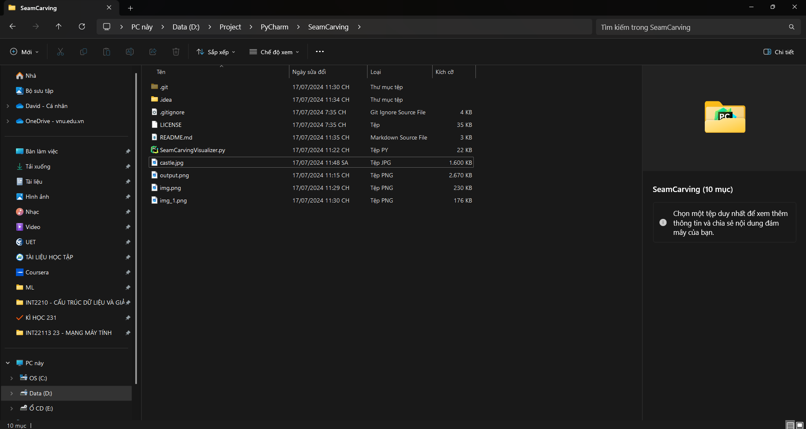
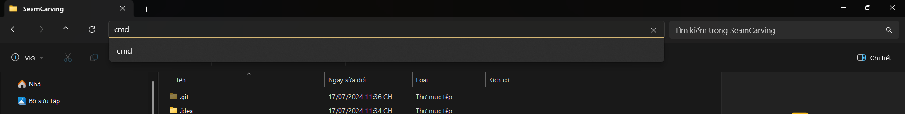
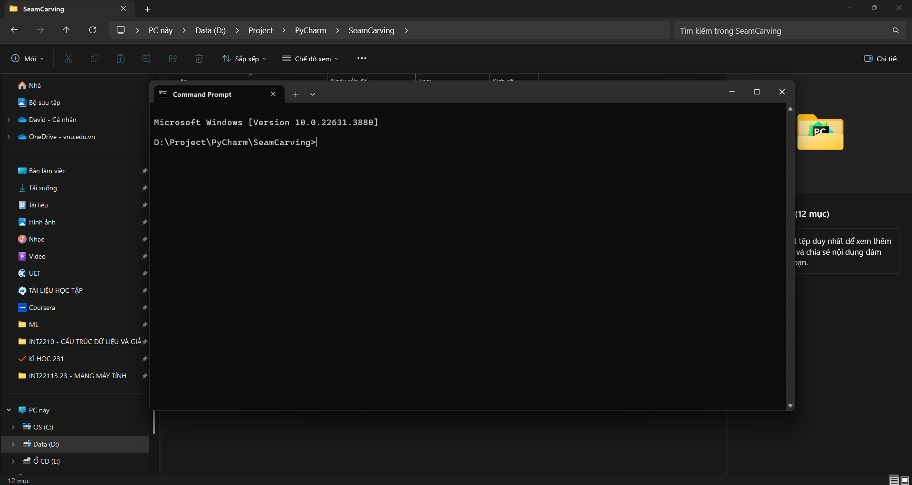
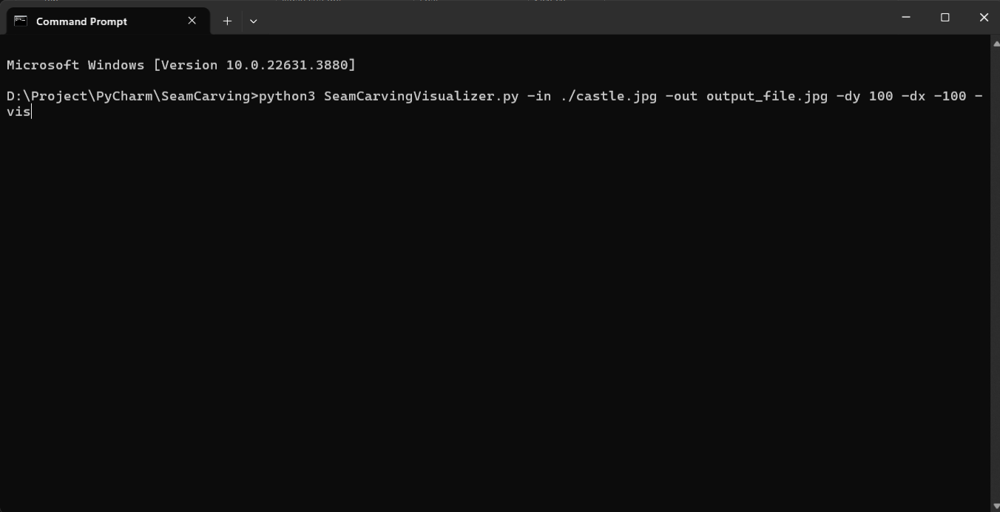
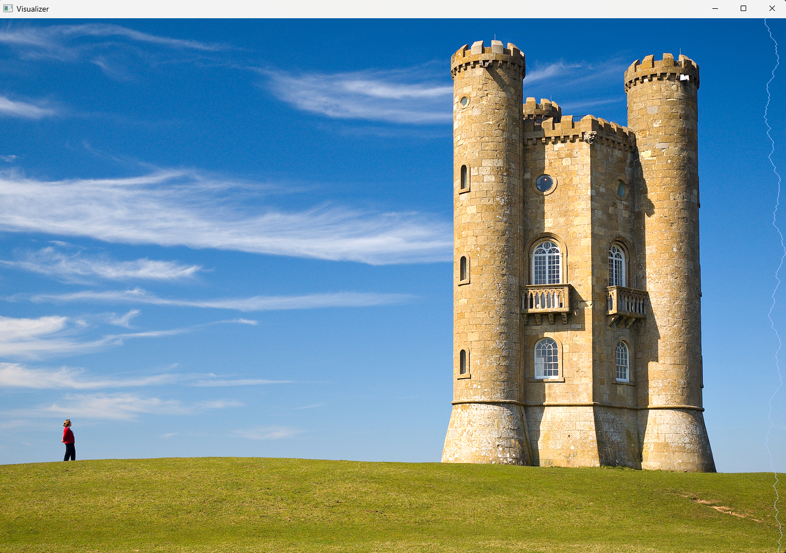

# Seam Carving

## I. Introduction

+ This is Seam Carving Visualizer application - A DSA Project planned and implemented by a student in University of Engineering and Technology.
+ The Seam Carving Visualizer application dynamically demonstrates the process of resizing images by intelligently removing or inserting seams, allowing users to see how the content-aware algorithm preserves essential visual elements while adjusting the image dimensions.

## II. What is Seam Carving?
+ Seam-carving is a content-aware image resizing technique where the image is reduced in size by one pixel of height (or width) at a time. A vertical seam in an image is a path of pixels connected from the top to the bottom with one pixel in each row; a horizontal seam is a path of pixels connected from the left to the right with one pixel in each column. Below left is the original 505-by-287 pixel image; below right is the result after removing 150 vertical seams, resulting in a 30% narrower image. Unlike standard content-agnostic resizing techniques (such as cropping and scaling), seam carving preserves the most interest features (aspect ratio, set of objects present, etc.) of the image.
+ Although the underlying algorithm is simple and elegant, it was not discovered until 2007. Now, it is now a core feature in Adobe Photoshop and other computer graphics applications.

 

## III. Installation & Usage
+ Users can run the Seam Carving Visualizer application on a Windows or Linux machine with Python 3 installed.
+ Download the source code from the GitHub repository or clone the repository to your local PC.
+ The Seam Carving Visualizer application requires the following libraries:
  + numpy
  + opencv-python
  + argparse
  + numba
  + scipy
+ To install the required libraries, run the following command:
  `pip install numpy pip3 install opencv-python pip install argparse pip install numba pip install scipy`
+ To run the Seam Carving Visualizer application, open a File Explorer window and navigate to the directory containing the source code

+ Type "cmd" in the address bar and press Enter to open a Command Prompt window in the directory

+ In the Command Prompt window, run the following command to execute the Seam Carving Visualizer application:
   `python3 SeamCarvingVisualizer.py -in <input_image_path> -out <output_image_file_name> [-dy DY] [-dx DX] [-vis]`

    * `-im`: The path to the image to be processed.
    * `-out`: The name for the output image.
    * `-dy`: Number of horizontal seams to add (if positive) or subtract (if negative). Default is 0.
    * `-dx`: Number of vertical seams to add (if positive) or subtract (if negative). Default is 0.
    * `-vis`: If present, display a window while the algorithm runs showing the seams as they are removed.

+ For example:
  + `python3 SeamCarvingVisualizer.py -in ./input_file.jpg -out output_file.jpg -dy 100 -dx -100 -vis`
  + `./input_file.jpg` is the path to the input image file where input_file.jpg is located in the same directory as the source code.
  

## IV. Preview

## V. Acknowledgement

#### **References**
+ The idea is inspired by **Seam Carving Assignment** on **Coursera: "Algorithm II"** course.
+ The implementation references from many different sources online

## VI. Contact me

We hope that you'll enjoy Seam Carving Visualizer.

[Phan Anh Tú](https://github.com/pat314)
